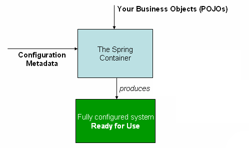

# Spring Ioc Container 와 Bean
## Container 개요
`org.springframework.context.ApplicationContext` 는 Spring IoC Container 를 나타내며, 빈의 인스턴스화, 설정, 조립을 담당한다. 
컨테이너는 메타데이터 설정을 읽어서 인스턴스화, 설정, 조립을 하기 위한 컴포넌트에 대한 명령어를 가진다.
설정 메타데이터는 컴포넌트 클래스의 어노테이션, 팩토리 메서드 설정 클래스, 또는 외부 XML 파일이나 그루비 스크립트로 표현한다.
어느것을 써도, 애플리케이션과 컴포넌트 간의 복잡한 의존관계를 구성할 수 있다.

`ApplicationContext`인터페이스의 몇가지 구현은 core Spring의 일부이다. 
단일 애플리케이션에서 `AnnotationConfigApplicationContext` 또는 `ClassPathXmlApplicationContext` 의 인스턴스를 만드는 건 흔한 일이다.

대부분의 애플리케이션 시나리오에서 명시적인 유저 코드는 하나 또는 더 많은 Spring IoC Container의 인스턴스를 요구하지 않는다.
예를 들어 플레인 웹 애플리케이션 시나리오에서 web.xml 에 있는 간단한 보일러플레이트 웹 디스크립터 XML이면 충분하다.
Spring Boot Scenario 에서는 일반적인 설정 관례에 따라 자동으로 초기화된다.

아래 다이어그램은 스프링이 동작방식에 대한 다이어그램이다. 애플리케이션 클래스는 설정 메타데이터와 결합하여 `ApplicationContext`를 생성하고 초기화된 이후에는 완전히 설정되고 실행가능한 시스템 또는 애플리케이션이 된다. 

## 메타 데이터 설정
위 다이어그램에서 봤듯이 Spring IoC Container는 메타 설정파일 폼을 사용한다. 이 메타데이터 설정은 Spring container에게 컴포넌트를 어떻게 인스턴스화하고 설정하고 조립할 것인지 지시한다.
Spring IoC Container는 메타데이터 설정이 작성된 포맷과 분리되어있다. 요즘에는 많은 개발자들이 Java 기반의 설정을 선택한다.
* Annotation 기반 설정: 애플리케이션 컴포넌트 클래스에서 어노테이션 기반으로 빈 정의
* 자바 기반 설정: 설정 파일을 사용해서 자바 외부에 빈을 정의. @Configuration, @Bean, @Import, @DependsOn

스프링 설정은 컨테이너가 관리해야하는 최소 하나, 보통은 하나보다 많은 정의로 구성된다. 자바 설정은 일반적으로 @Bean 을 사용한다.
- `@Configuration` 클래스 내 빈 정의에 일치하는 각각의 메서드에 어노테이션

이 빈 설정은 애플리케이션에서 만들어내는 실제 객체와 일치한다. 일반적으로 서비스 레이어 객체, repository나 데이터 접근 객체(dao), 웹 컨트롤러와 같은 프레젠테이션 객체, JPA EntityManagerFactory 같은 인프라 객체, JMS Queue 기타 등을 정의한다.
일반적으로 세분화된 도메인 객체는 잘 정의하지 않는데, 도메인 객체를 생성하고 로드하는 것은 repository와 business의 책임이기 때문이다. 

---
## 새롭게 알게 된 표현
* With either format: 어느것을 써도
* suffice: 격식있는 표현의 동사. (필요, 목적 등에)충분하다, 족하다, 흡족하다
* Bootstrap: 한 번 시작되면 알아서 진행되는 일련의 과정
* so forth: 기타 등등