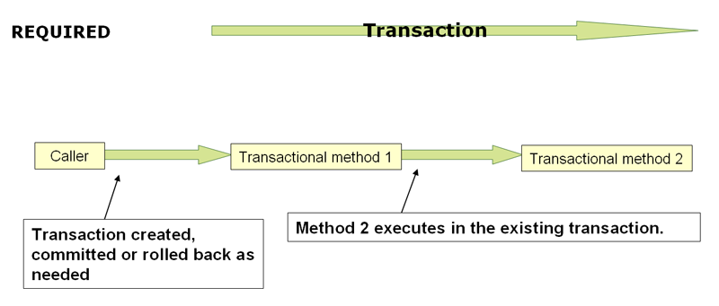
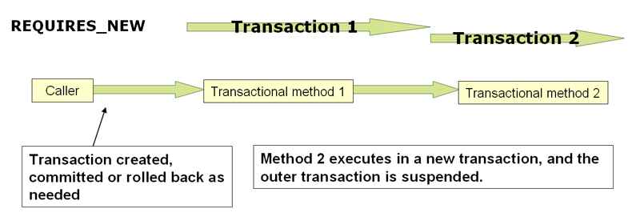

# Transaction Propagation
스프링에서 관리되는 트랜잭션에서는 논리적 트랜잭션과 물리적 트랜잭션의 차이와 propagation 세팅이 어떻게 그 차이에 적용되는지 알아야한다.

## PROPAGATION_REQUIRED

`PROPAGATION_REQUIRED` 는 트랜잭션이 없는 경우 물리적으로 트랜잭션을 강제하거나 더 큰 스코프로 정의된 '외부' 트랜잭션이 존재하는 경우, 참여한다.
동일한 스레드 내에서 호출하는 스택 구조에서는 무난한 디폴트 설정이다.(예를 들어, 여러 repository 메서드에 위임하는 서비스 진입점이 있고, 그 하위 리소스들이 서비스 레벨에 참여해야하는 그런 상황)

기본적으로 참여하는 트랜잭션은 외부 스코프의 특성에 따르게되면, 만약 있었다면 로컬 격리 레벨, 타임아웃 값, read-only flag를 조용히 무시하게 된다.
트랜잭션 매니저에서 `validateExistingTransaction` flag 를 true 로 설정하면 다른 격리레벨을 가진 트랜잭션에 참여할 때 격리 레벨이 거부되도록 할 수 있다.
이 non-lenient 모드는 read-only 플래그가 다른 경우 또한 거절된다.(내부의 read-write 트랜잭션이 외부 read-only 스코프에 참여하려고 시도하는 그런 상황)

propagation 세팅이 `PROPAGATION_REQUIRED` 일 때는 논리적 트랜잭션 스코프가 세팅이 적용되어있는 메서드에 생성된다.
각 논리 트랜잭션 스코프는 rollback-only 상태를 개별적으로 정할수 있으며, 외부 트랜잭션 스코프는 내부 트랜잭션 스코프와 논리적으로 구분된다.
표준 `PROPAGATION_REQUIRED` 동작의 경우에는, 모든 스코프가 물리적 트랜잭션에 매핑된다. 따라서 내부 트랜잭션 스코프에 세팅된 rollback-only 마커는 외부 트랜잭션이 실제로 커밋할 수 있는지 여부에 영향을 미친다.

그러나 내부 트랜잭션 스코프가 rollback-only 마커가 세팅되어있는 경우에, 외부 트랜잭션은 롤백을 스스로 결정하지 못하게 되고, 내부 트랜잭션 스코프로 인해 조용히 트리거된 롤백은 예상하지 못한다.
이 때 `UnexpectedRollbackException`이 발생한다. 트랜잭션 호출자가 실제로 커밋이 되지 않았는데, 커밋되었다고 잘못 추정하는 것을 막기위한 의도적인 장치이다.
내부 트랜잭션이 조용히 rollback-only 로 표시되면 외부 호출자는 여전히 커밋할 수 있다. 하지만, 외부 호출자는 커밋 대신 롤백이 수행되었다는 걸 명시하기 위한 `UnexpectedRollbackException`을 받게 된다. 

## PROPAGATION_REQUIRES_NEW

`PROPAGATION_REQUIRES_NEW` 는 `PROPAGATION_REQUIRED`와 반대로 각각의 트랜잭션 스코프에 대해 항상 독립적인 물리 트랜잭션을 사용하며, 이미 존재하는 외부 스코프의 트랜잭션에 절대 참여하지 않는다.
이러한 구조에서는 하위 리소스 트랜잭션들이 모두 다르기 때문에, 개별적으로 커밋되거나 롤백될 수 있다. 그 결과 외부 트랜잭션은 내부 트랜잭션의 롤백 상태에 영향을 받지 않으며, 내부 트랜잭션의 락은 수행이 완료되는 즉시 해제된다.
이러한 독립적인 내부 트랜잭션은 격리 레벨, 타임아웃, read-only 세팅을 각각 지정할 수 있으면, 외부 트랜잭션의 특성을 상속받지 않는다.

## 새롭게 알게 된 표현
* lenient: 관대한
* delegate: 위임하다, 대리
* backed by: ~에 의해 뒷받침되는, ~를 기반으로 하는
* mislead: 속이다, 잘못 인도하다